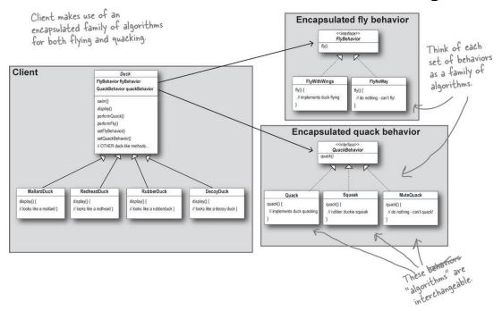

# Strategy Pattern

The Strategy pattern enables selecting an algorithm at runtime instead of implementing a single algorithm directly. Code receives run-time instructions as to which in a family of algorithms to use and lets the algorithm vary independently from clients that use it.

#### Quick Notes
* Take the parts that vary and encapsulate them so that later you can alter or extend the parts that vary without affecting those that dont't
* programs to an interface, not an implementation
* Favour composition over inheritance
* the behaviours of a class should not be inherited, instead they should be encapsulated using interfaces which is compatible with the Open/closed principle which proposes that classes should be open for extension but closed for modification.

#### Pros
* prevents conditional statements
* algorithms can be used inside an object at runtime.
* algorithms are loosely coupled with context entity, they can be replaced without changing context entity
* implementing new behaviours is easy
* You can replace inheritance with composition.

#### Cons
* Increases number of onjects in the application
* Clients must know existence of different stategies and a client must understand how the stragies differ
* If a class has algorithms that rarely change, there is no need to overcomplicate the program.

#### Example Code Explained
In this example, There are numerous types of Ducks and they all quack, swim and fly. However, some ducks fly differently, some ducks quack differently, and some might swim differently. Instead of coding all sorts of different methods for each different duck, we use the strategy pattern and program the altering behaviours to an interface so that at run time, each duck receives instructions as to which behaviour algorithm to use.
