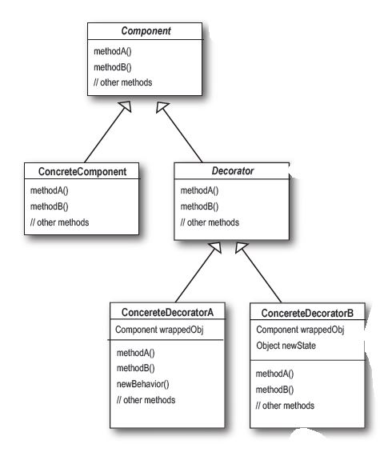

# Strategy Pattern

The decorator pattern is a design pattern that allows behaviour to be added to an individual object, dynamically without affecting the behaviour of other objects from the same class. 

#### Quick Notes
* Decorators have the same supertype as the objects they decorate either through inheritance or interface implementation
* you can use one or more decorators to wrap an object. 
* the decorated object can be passed around in place of the original wrapped object
* objects can be decorated at any time so we can decorate objects dynamically at runtime with as many decorators as we want
* The Decorator Pattern attaches additional responsibilities to an object dynamically
* Decorators provide a flexible alternative to subclassing for extending functionality

#### Pros
* repoonsibilities and behaviours can be dynamically added and removed at run time
* numerous decorators can be added in any order and duplicate times
* extends the functionality of an object without affecting any other object

#### Cons
* Decorators can result in many small objects in our design and overuse can be complex

#### Example Code Explained
In this example, We are running a coffee shop and want to be able to create drinks and include additional cost for various sizes and condiments . The decorator pattern is leveraged to create drinks and charge for any combination of condiments added.  

Sources:
Freeman, Eric; Robson, Elisabeth; Bates, Bert; Sierra, Kathy. Head First Design Patterns (Kindle Location 1634). O'Reilly Media. Kindle Edition